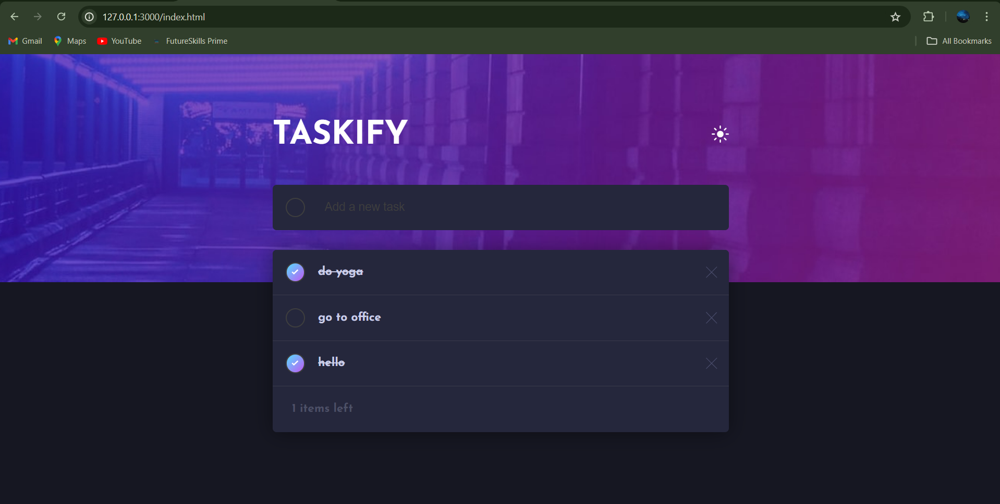

# Taskify - To-Do List App

Taskify is a feature-rich to-do list application built using HTML, CSS, JavaScript, and Firebase Firestore. It provides a seamless and intuitive user experience for managing tasks, with real-time synchronization across devices.

## Features

- **Add Tasks:** Easily add new tasks to your to-do list.
- **Mark Tasks as Completed:** Toggle tasks between active and completed states.
- **Delete Tasks:** Remove tasks from your list as needed.
- **Real-Time Updates:** Enjoy real-time synchronization of tasks across devices using Firebase Firestore.
- **Task Counter:** See how many active tasks are left to complete.

## Technologies Used

- Frontend: HTML, CSS, JavaScript
- Backend: Firebase Firestore
- Tools: Visual Studio Code, Firebase SDK

## Installation

To run Taskify locally:

1. Clone this repository.
2. Set up Firebase Firestore and update the Firebase configuration in `firebase.js`.
3. Open `index.html` in your web browser.

## Usage

- Add a new task by typing in the input field and pressing Enter.
- Click on a task to mark it as completed.
- Click on the delete icon next to a task to remove it from the list.

